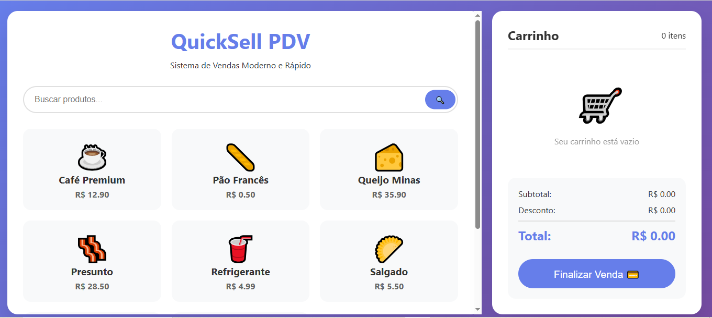

# 🛒 QuickSell PDV

Um sistema **front-end de Ponto de Venda (PDV)** moderno e responsivo, desenvolvido em **HTML, CSS e JavaScript puro**.  
Este projeto simula um sistema de vendas simples, permitindo **listar produtos, buscar, adicionar ao carrinho, calcular descontos e finalizar a compra**.

---

## 🚀 Funcionalidades

- 🔍 **Busca em tempo real** por produtos  
- 🛍️ **Catálogo de produtos** exibido em cards interativos  
- ➕➖ **Controle de quantidade** de produtos no carrinho  
- ❌ **Remoção de itens** do carrinho  
- 💰 **Cálculo automático** de subtotal, desconto e total  
- 🎉 **Finalização de venda** com modal de sucesso  
- 📱 **Layout responsivo** para desktop e mobile  
- ✨ **Animações suaves** para melhor experiência do usuário  

---

## 🖼️ Demonstração

Click no link para testar o sistema


  

---

## 🛠️ Tecnologias Utilizadas

- **HTML5** – Estrutura da aplicação  
- **CSS3** – Estilização moderna e responsiva  
- **JavaScript (Vanilla JS)** – Lógica de funcionamento  

---

## 📦 Como Executar

1. Baixe ou clone este repositório:
   ```bash
   git clone https://github.com/ReiBrito/quicksell-pdv.git
Abra o arquivo index.html diretamente no navegador.

Pronto! 🎉 O sistema já estará rodando.

📂 Estrutura do Projeto
bash
Copiar
Editar
📦 quicksell-pdv
 ┣ 📜 index.html   # Página principal com HTML, CSS e JS embutidos
 ┗ 📜 README.md    # Documentação do projeto
📌 Próximos Passos (Ideias de Melhorias)
 Implementar persistência do carrinho no localStorage

 Adicionar suporte a cadastro de novos produtos

 Criar integração com um backend real (PHP/MySQL ou Node.js)

 Gerar recibos em PDF após a finalização da venda

📄 Licença
Este projeto está sob a licença MIT.
Sinta-se livre para usar, modificar e compartilhar!

👨‍💻 Desenvolvido com ❤️ por Reinaldo Brito
